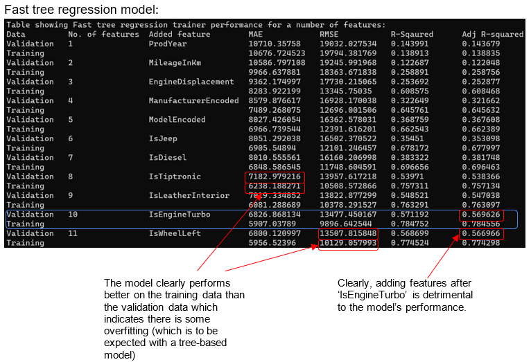
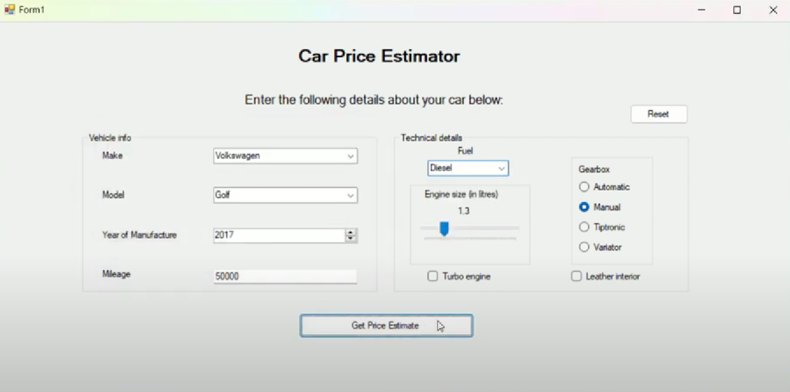
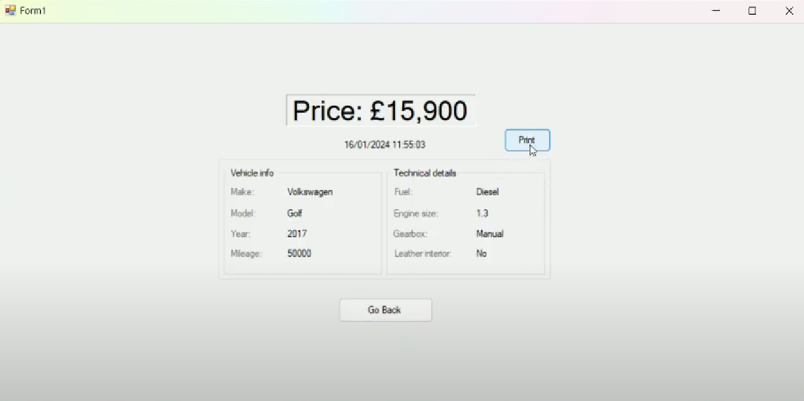

# Car Price Estimator With Regression
This repository contains the code for my A-level coursework project: a car price estimator using regression analysis. The project makes use of a relatively small dataset provided by Kaggle, containing data about the sale price of cars along with various vehicle details and specifications. The car price estimator aims to calculate an instant price estimation based on a set of car details provided by the user.

The project was split into two stages; the first stage being where I train and test different regression models on the data, and the second being where the optimal regression model is integrated into the final car price estimator system. 

In the regression analysis part, multiple models were trained, tuned and tested. These models include a simple linear model, a multi linear model (using gradient descent optimisation), a k-nearest neighbours model and a decision tree model. In order to obtain a tuned model, each model had to undergo a series of processes including data preprocessing, feature selection, cross validation and hyperparameter fine-tuning. After obtaining the tuned models, each model was tested with holdout data, which acted as a final test to gauge how well the models could could generalise and predict new, unseen data. I have outlined this regression analysis process that I have carried out in more detail [here](./docs/NEA%20Regression%20Analysis%20Report.pdf).

The best-performing regression model was then integrated into the car price estimator and I developed a simple user interface to allow users to input their car details and receive an instant price estimation. You can see the operation of the car price estimator [here](https://youtu.be/H5B1dWf65uo).

    
    

The full documentation can be found [here](./docs/NEA%20Final%20Report.pdf).